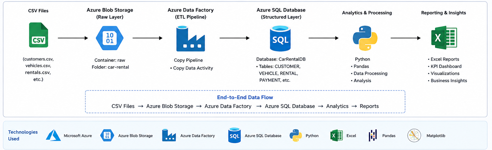
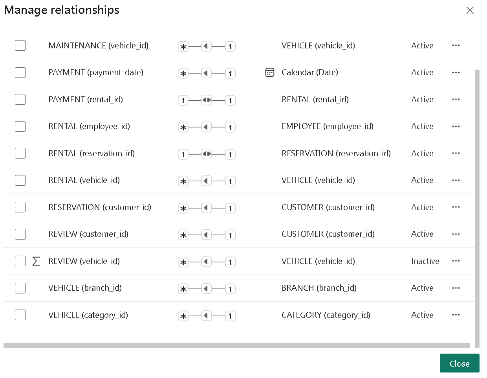
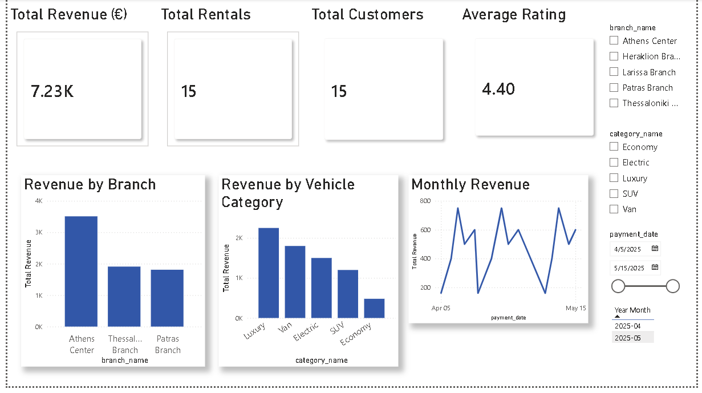
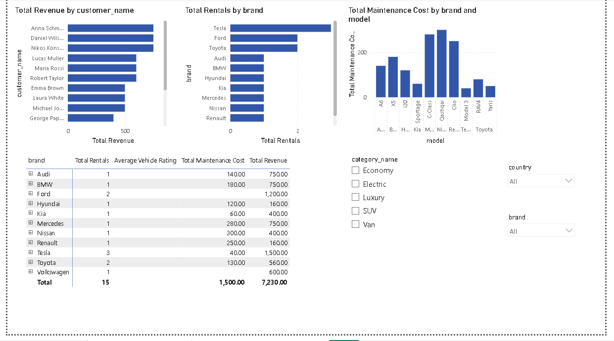

# Azure Car Rental ETL Pipeline & Power BI Dashboard


## Table of Contents

- Project Overview
- Architecture
- Technologies
- Azure Resources
- Database Schema
- ETL Pipeline
- Power BI Dashboard
- Project Structure
- How to Run
- Skills Demonstrated

An end-to-end cloud data engineering and business intelligence project built with Azure Blob Storage, Azure Data Factory, Azure SQL Database, SQL, and Power BI.



## Project Overview

This project implements a cloud-based data pipeline for a car rental company. Car rental datasets are stored as CSV files in Azure Blob Storage, transferred into Azure SQL Database through Azure Data Factory, validated with SQL, and analyzed through an interactive Power BI dashboard.

```text
CSV Files
   ↓
Azure Blob Storage
   ↓
Azure Data Factory
   ↓
Azure SQL Database
   ↓
SQL Validation and Analysis
   ↓
Power BI Data Model
   ↓
Interactive Dashboards
```

The dataset is synthetic and was created for educational and portfolio purposes.

## Business Objectives

The solution answers questions such as:

- Which branch generates the highest revenue?
- Which vehicle categories are the most profitable?
- How does revenue change over time?
- Which customers generate the most revenue?
- Which vehicles are rented most frequently?
- Which vehicles have the highest maintenance costs?
- What is the average rating by vehicle category?
- What is the net contribution after maintenance costs?
- Which payment methods are used most frequently?
- Which employees process the most rentals and revenue?

## Technologies Used

- Microsoft Azure
- Azure Blob Storage
- Azure Data Factory
- Azure SQL Database
- Microsoft SQL Server
- SQL
- Power BI Desktop
- Power Query
- DAX
- CSV
- Git and GitHub

## Solution Architecture

1. Car rental CSV files are uploaded to `raw/car-rental` in Azure Blob Storage.
2. Azure Data Factory connects to Blob Storage and Azure SQL Database through linked services.
3. A Copy Data activity transfers source data into Azure SQL.
4. SQL validation queries verify row counts, key integrity, relationships, dates, and monetary values.
5. Power BI connects to Azure SQL Database using Import mode.
6. A relational model and reusable DAX measures support interactive reporting.
7. Two dashboard pages present executive, customer, fleet, maintenance, and rating insights.

## Azure Resources

The Azure environment contains:

- Resource group: `rg-car-rental-data`
- Storage account containing the source CSV files
- Blob container: `raw`
- Source folder: `car-rental`
- Azure Data Factory instance: `adf-car-rental`
- Azure SQL logical server
- Azure SQL database: `CarRentalDB`

Sensitive values such as passwords, access keys, connection strings, subscription identifiers, and firewall details are not stored in this repository.

## Source Data

The source layer contains CSV exports for:

- `branches.csv`
- `categories.csv`
- `customers.csv`
- `employees.csv`
- `maintenances.csv`
- `payments.csv`
- `rentals.csv`
- `reservations.csv`
- `reviews.csv`
- `vehicles.csv`

## Database Schema

The Azure SQL database contains:

- `BRANCH`
- `CATEGORY`
- `CUSTOMER`
- `EMPLOYEE`
- `VEHICLE`
- `RESERVATION`
- `RENTAL`
- `PAYMENT`
- `REVIEW`
- `MAINTENANCE`

The schema includes primary keys, foreign keys, identity columns, `NOT NULL`, `UNIQUE`, and `CHECK` constraints.

## ETL Pipeline

The Azure Data Factory implementation demonstrates:

- Azure Blob Storage linked service
- Azure SQL Database linked service
- Delimited-text source dataset
- Azure SQL destination dataset
- Copy Data activity
- Source-to-destination column mapping
- Pipeline validation
- Debug execution
- Successful pipeline monitoring

The implemented pipeline copied customer records from Blob Storage into the Azure SQL `CUSTOMER` table and was verified in Azure Data Factory and Azure SQL Query Editor.

## Data Validation

The `sql/03_validation_queries.sql` script performs:

- Table discovery
- Row counts for every table
- Primary-key range checks
- Duplicate email detection
- Duplicate payment detection
- Orphaned foreign-key checks
- Reservation and rental date validation
- Negative monetary value checks
- Review rating validation
- Rental-cost and payment-amount comparison
- Final KPI summary

Final Azure SQL row counts:

| Table | Rows |
|---|---:|
| BRANCH | 5 |
| CATEGORY | 5 |
| CUSTOMER | 15 |
| EMPLOYEE | 8 |
| VEHICLE | 13 |
| RESERVATION | 15 |
| RENTAL | 15 |
| PAYMENT | 15 |
| REVIEW | 10 |
| MAINTENANCE | 10 |

Foreign-key validation queries returned zero invalid rows.

## SQL Business Analysis

The `sql/04_business_queries.sql` script includes:

- Executive KPI summary
- Total revenue
- Average rental value
- Average rental duration
- Revenue by branch
- Revenue by vehicle category
- Monthly and daily revenue trends
- Top customers by revenue
- Revenue by customer country
- Vehicle rental frequency and utilization
- Maintenance cost analysis
- Revenue versus maintenance cost
- Average rating by vehicle and category
- Employee revenue analysis
- Payment method analysis
- Reservation status distribution
- Revenue ranking and cumulative revenue

These queries independently validate the metrics displayed in Power BI.

## Power BI Data Model

Power BI connects directly to Azure SQL Database and imports the relational tables.

Key relationships include:

```text
CUSTOMER 1 ─── * RESERVATION
CATEGORY 1 ─── * VEHICLE
BRANCH 1 ─── * VEHICLE
EMPLOYEE 1 ─── * RENTAL
VEHICLE 1 ─── * RENTAL
RESERVATION 1 ─── 1 RENTAL
RENTAL 1 ─── 1 PAYMENT
CUSTOMER 1 ─── * REVIEW
VEHICLE 1 ─── * MAINTENANCE
```

Most relationships use single-direction filtering to reduce ambiguity.



## DAX Measures

The report uses reusable measures, including:

```DAX
Total Revenue =
SUM(PAYMENT[amount])
```

```DAX
Total Rentals =
DISTINCTCOUNT(RENTAL[rental_id])
```

```DAX
Total Customers =
DISTINCTCOUNT(CUSTOMER[customer_id])
```

```DAX
Average Rental Value =
DIVIDE([Total Revenue], [Total Rentals], 0)
```

```DAX
Average Rating =
AVERAGE(REVIEW[rating])
```

```DAX
Total Maintenance Cost =
SUM(MAINTENANCE[cost])
```

```DAX
Average Rental Duration =
AVERAGEX(
    RENTAL,
    DATEDIFF(RENTAL[pickup_date], RENTAL[return_date], DAY)
)
```

```DAX
Net Contribution =
[Total Revenue] - [Total Maintenance Cost]
```

## Power BI Dashboards

### Executive Dashboard

The Executive Dashboard includes:

- Total Revenue
- Total Rentals
- Total Customers
- Average Rating
- Revenue by Branch
- Revenue by Vehicle Category
- Monthly Revenue Trend
- Branch, category, and payment-date slicers



### Customer & Fleet Analysis

The second report page includes:

- Top Customers by Revenue
- Vehicle Rental Frequency
- Maintenance Cost by Vehicle
- Average Rating by Category
- Fleet Performance Matrix
- Country, brand, and category slicers



## Key Results

The current synthetic dataset produces:

- Total revenue: **€7,230**
- Total rentals: **15**
- Total customers: **15**
- Average customer rating: **4.40**
- Athens Center generated the highest branch revenue.
- Luxury was the highest-revenue vehicle category.

These results demonstrate the workflow and do not represent a real rental company.

## Project Structure

```text
Azure Car Rental ETL Pipeline/
│
├── CarRentalDashboard.pbix
├── README.md
├── .gitignore
├── LICENSE
│
├── sql/
│   ├── 01_create_database.sql
│   ├── 02_insert_sample_data.sql
│   ├── 03_validation_queries.sql
│   └── 04_business_queries.sql
│
└── screenshots/
    ├── 01_storage_account.png
    ├── 02_blob_container.png
    ├── 03_blob_container_files.png
    ├── 04_azure_sql_database.png
    ├── 05_tables_created.png
    ├── 06_customer_query_result.png
    ├── 07_data_factory_home.png
    ├── 08_pipeline_success.png
    ├── 09_project_architecture.png
    ├── 10_powerbi_model_final.png
    ├── 11_executive_dashboard.png
    └── 12_customer_fleet_dashboard.png
```

## Repository Files

- `sql/01_create_database.sql`: creates tables, keys, constraints, and relationships.
- `sql/02_insert_sample_data.sql`: inserts the synthetic dataset.
- `sql/03_validation_queries.sql`: verifies completeness and integrity.
- `sql/04_business_queries.sql`: reproduces the dashboard metrics in SQL.
- `CarRentalDashboard.pbix`: contains the Power BI model, DAX measures, slicers, and dashboard pages.

## How to Reproduce the Project

### Prerequisites

- Microsoft Azure subscription
- Power BI Desktop
- Azure SQL Database access
- Azure Data Factory access
- SQL Server Management Studio or Azure SQL Query Editor

### 1. Create the database schema

Run:

```text
sql/01_create_database.sql
```

against an empty Azure SQL database.

### 2. Load sample data

Either execute:

```text
sql/02_insert_sample_data.sql
```

or upload the CSV files to Azure Blob Storage and configure Azure Data Factory Copy Data activities.

### 3. Validate the database

Run:

```text
sql/03_validation_queries.sql
```

Expected results include no orphaned foreign keys, invalid dates, negative financial values, or invalid ratings.

### 4. Run the analytical queries

Execute:

```text
sql/04_business_queries.sql
```

to reproduce the business metrics independently of Power BI.

### 5. Open the Power BI report

Open:

```text
CarRentalDashboard.pbix
```

Update the Azure SQL data-source credentials if necessary, then select **Refresh**.

## Security and Cost Considerations

- No Azure credentials are stored in this repository.
- No storage access keys or SQL passwords are committed.
- The Blob container uses private access.
- Azure SQL firewall access should be restricted to approved addresses.
- Development-oriented Azure resources were used for this portfolio project.
- Azure resources should be scaled down or deleted when no longer required.
- Screenshots should not expose subscription IDs, passwords, access keys, or connection strings.

## Skills Demonstrated

- Azure resource organization
- Azure Blob Storage
- Azure Data Factory
- Azure SQL Database
- ETL pipeline development
- Linked services and datasets
- SQL database design
- SQL data validation
- Business-oriented SQL analysis
- Power Query
- Relational data modeling
- DAX measures
- Power BI dashboard design
- Interactive filtering
- Data visualization
- Git and GitHub documentation

## Future Improvements

- Parameterized Azure Data Factory datasets
- Metadata-driven ingestion for all CSV files
- Scheduled and incremental loading
- Azure Key Vault integration
- Managed identities
- Error logging and rejected-row handling
- Power BI Service deployment and scheduled refresh
- Row-level security
- Larger synthetic datasets
- Microsoft Fabric, Azure Synapse, or Databricks integration
- CI/CD with GitHub Actions or Azure DevOps

## Related Projects

### Car Rental Database Management System

A complete SQL Server database design and advanced SQL project:

`https://github.com/thomasbeo/CarRentalDatabaseManagementSystem`

### Car Rental Analytics

A Python analytics project using Pandas, Matplotlib, Jupyter Notebook, and Excel reporting:

`https://github.com/thomasbeo/CarRentalAnalytics`

## Author

**Thomas Beopoulos**

Electrical and Computer Engineering graduate, University of Patras.

GitHub: `https://github.com/thomasbeo`
